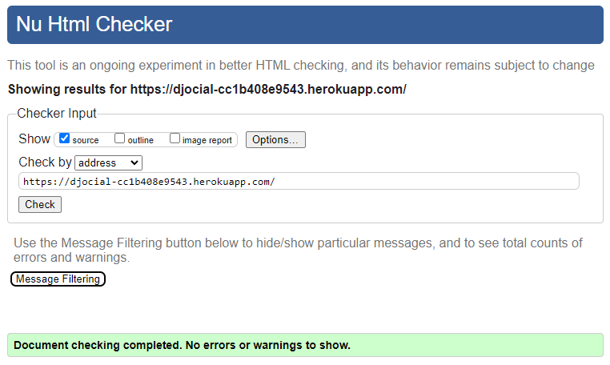

# Djocial

Welcome to **Djocial**, a straightforward social media platform designed to connect users and facilitate interactions in a seamless environment. Developed with the Django framework, Djocial leverages a robust tech stack to deliver a dynamic and user-friendly experience.

### View the live website [here](https://djocial-cc1b408e9543.herokuapp.com/)

### Project Overview

Djocial is a simple yet powerful social media website where users can create accounts, post updates, follow other users, and engage in meaningful conversations. This project showcases the integration of several technologies to build a functional and interactive web application.

### Technologies Used
-   **JavaScript**: Adds interactivity and dynamic content to the web pages.
-   **CSS**: Provides styling and responsive design to ensure an appealing and user-friendly interface.
-   **HTML**: Structures the content and layout of the website.
-   **Python**: Serves as the primary programming language for backend development.
-   **Django**: The web framework that facilitates rapid development and clean, pragmatic design.
-   **PostgreSQL**: A powerful and reliable database management system used to store user data and application information.

### Project Rationale

**Djocial** was created to address the need for a basic yet functional social media platform that emphasizes core features of user interaction and engagement. The rationale behind developing Djocial stems from several key objectives:

1.  **Educational Purpose**: The project serves as a comprehensive learning experience, integrating multiple technologies in a cohesive manner. By working with Django for backend development and combining it with JavaScript, CSS, and HTML for the frontend, Djocial provides a practical application of web development skills.
    
2.  **User-Centric Design**: Djocial aims to offer a clean and intuitive user interface that facilitates easy navigation and interaction. The focus is on simplicity and usability, allowing users to create accounts, post content, and engage with others without being overwhelmed by unnecessary features.
    
3.  **Scalability and Extensibility**: While Djocial starts with a basic feature set, the underlying architecture is designed to be scalable. This allows for future enhancements and the addition of more complex features, such as advanced messaging systems or integration with third-party APIs, without requiring a complete overhaul of the codebase.
    
4.  **Real-World Application**: By simulating a social media environment, Djocial provides a practical example of how modern web technologies can be used to build interactive and engaging applications. This project is particularly useful for students and developers looking to understand the intricacies of web development in a real-world context.

Overall, Djocial exemplifies the integration of modern web development practices and serves as a valuable resource for both learning and practical application.

## Features

**Social** offers a range of features designed to enhance user interaction and engagement on the platform. Below is a detailed overview of the key functionalities currently implemented:

### 1. View Full Post Content

-   **As a Site User, I can click on a post so that I can view the full content and details.**
    -   Users can click on any post to access a detailed view, displaying the full content and associated details.

### 2. User Registration and Authentication

-   **As a Site User, I can register an account so that I can post and interact with other users.**
    -   Users can register an account using an email address.
    -   Once registered, users can log in, create posts, and interact with other users by commenting and liking posts.

### 3. Create and Share Posts

-   **As a Site User, I can post content so that I can share my thoughts with my followers and the public.**
    -   Users can create and publish posts that are visible to all users.
    -   Posts are displayed on the user’s timeline and can receive replies from other users.

### 4. Like and Unlike Posts

-   **As a Site User, I can like a post so that I can show my appreciation or agreement with the content.**
    -   Users can like posts by clicking the "like" button, which increments the like count.
    -   Users also have the option to unlike a post, which decrements the like count.

### 5. Comment on Posts

-   **As a Site User, I can comment on a post so that I can share my thoughts or start a conversation.**
    -   Logged-in users can comment on posts, with comments displayed beneath the original post.
    -   Other users can reply to comments, allowing for conversation threads.

### 6. Admin Post Management

-   **As a Site Admin, I can create, read, update, and delete posts so that I can manage the content on the platform.**
    -   Admins have full control over content management, including the ability to create, view, update, or delete any post for compliance or policy reasons.

### 7. Edit and Delete Personal Posts

-   **As a Site User, I can modify or delete my post so that I can update or remove content I’ve shared.**
    -   Users can edit their posts to update content or delete them entirely at any time.

### 8. Profile Description

-   **As a Site User, I can add a description to my profile so that I can share more about myself with others.**
    -   Users can add or edit a short bio/description in their profile settings.
    -   The profile description is visible on the user’s profile page and is limited to 300 characters.

### 9. Search Functionality

-   **As a Site User, I can search for users and posts across the entire platform so that I can find content or people of interest.**
    -   Users can utilize a search bar to find relevant posts and profiles based on a query.
    -   Search results include both user profiles and posts that match the search criteria.

### 10. Infinite Scrolling

-   **As a Site User, I can infinitely scroll through posts so that I can view more content without having to manually load new pages.**
    -   The platform supports infinite scrolling, where more posts are automatically loaded as the user scrolls down, optimizing the browsing experience.

### 11. Feed Customization

-   **As a Site User, I can switch between different feed options like "Only Followers" and "Trending" so that I can customize my content experience.**
    -   Users can toggle between various feed options:
        -   "Only Followers" displays posts only from accounts the user follows.
        -   "Trending" shows posts that are currently popular across the platform.
  
 ## Wireframes
 ## Technologies Used

**Social** leverages a variety of technologies and libraries to deliver a robust and responsive social media platform. Below is a list of the key technologies and tools used in this project:

### Core Technologies

-   **Django**: The primary web framework used to build the backend of the application, enabling rapid development and clean, pragmatic design.
-   **Gunicorn**: A WSGI HTTP server used to serve the Django application in a production environment.
-   **PostgreSQL**: A powerful, open-source relational database used to store user data, posts, comments, and other application-related information.
-   **JavaScript**: Enhances interactivity and dynamic content on the frontend.
-   **Custom CSS**: Provides custom styling and responsive design to ensure a user-friendly interface.
-   **Font Awesome**: A popular icon toolkit used to add scalable vector icons to the UI.

### Python Libraries

-   **asgiref==3.8.1**: ASGI (Asynchronous Server Gateway Interface) reference implementation for handling asynchronous operations in Django.
-   **cloudinary==1.36.0**: Manages media storage and delivery, integrating with Cloudinary for efficient image and video management.
-   **dj-database-url==0.5.0**: Simplifies database configuration by parsing URLs into Django’s database settings.
-   **dj3-cloudinary-storage==0.0.6**: Custom storage backend for Django integrating with Cloudinary.
-   **Django==4.2.15**: The Django framework version used in this project.
-   **django-allauth==0.57.2**: Provides a comprehensive user authentication system, enabling registration, login, and social account integration.
-   **django-summernote==0.8.20.0**: Adds a WYSIWYG editor to Django admin, simplifying content management.
-   **gunicorn==20.1.0**: Utilized as the WSGI HTTP server in the production environment.
-   **oauthlib==3.2.2**: A framework to handle OAuth requests, used in conjunction with django-allauth for managing social authentication.
-   **psycopg2==2.9.9**: A PostgreSQL adapter for Python, enabling interaction with the PostgreSQL database from Django.
-   **PyJWT==2.9.0**: A library for handling JSON Web Tokens (JWT), often used for securely transmitting information between parties.
-   **python3-openid==3.2.0**: Implements OpenID authentication, used by django-allauth for handling OpenID login.
-   **requests-oauthlib==2.0.0**: Extends the popular `requests` library to support OAuth 1 and OAuth 2, facilitating authentication via third-party providers.
-   **sqlparse==0.5.1**: A tool for parsing SQL statements, useful for various database operations.
-   **urllib3==1.26.19**: A powerful HTTP client for Python, used by several other libraries for making network requests.
-   **whitenoise==6.7.0**: Serves static files in a production environment, reducing the need for an external server.

## Testing
### Code Validation

#### HTML

I used the [HTML W3C Validator](https://validator.w3.org) to ensure all HTML files are valid.

| Directory | File      | Screenshot |
|-----------|-----------|------------|
| djocial   | index.html |  |

#### CSS

I used the [CSS Jigsaw Validator](https://jigsaw.w3.org/css-validator) to validate all CSS files.

| Directory | File      | Screenshot |
|-----------|-----------|------------| 
| djocial   | style.css |  |

#### JavaScript

I validated all JS files using [JShint Validator](https://jshint.com).

| Directory | File      | Screenshot |
|-----------|-----------|------------|
| djocial   | script.js |  |  

#### Python

I used [PEP8 CI Python Linter](https://pep8ci.herokuapp.com) to check all Python files.

| File                | Screenshot |
|---------------------|------------|
| apps.py             |  |
| forms.py            |  |
| models.py           |  |
| urls.py             |  |
| views.py            |  |

#### Lighthouse Audit

The Lighthouse Audit tool was used to evaluate the deployed project's performance and other metrics.

##### Desktop
| Page               | Screenshot |
|--------------------|------------|
| Index              |  | 

### General Testing
- All features were developed on the main branch.
- Each feature addition was followed by comprehensive testing to ensure no functionality was affected.
- The website was tested by friends and relatives for feedback.
- Username inputs are validated to ensure correct information is submitted.
- A `.gitignore` file is included to avoid committing system files.
- External links are set to open in a new tab.

### Feature Testing

The following table details the manual testing of each feature implemented in **Social** to ensure they are functioning correctly:

| Feature                                    | Description                                                                                                           | Test Result |
|--------------------------------------------|-----------------------------------------------------------------------------------------------------------------------|-------------|
| View Full Post Content                     | Users can click on a post to view its full content and details.                                                        | Passed      |
| User Registration and Authentication       | Users can register, log in, create posts, and interact with other users by commenting and liking posts.                | Passed      |
| Create and Share Posts                     | Users can create and publish posts visible to all users, and posts can receive replies.                               | Passed      |
| Like and Unlike Posts                      | Users can like and unlike posts, and the like count updates accordingly.                                               | Passed      |
| Comment on Posts                           | Logged-in users can comment on posts, and others can reply to comments, allowing for conversation threads.            | Passed      |
| Admin Post Management                      | Admins can create, read, update, and delete posts for content management purposes.                                    | Passed      |
| Edit and Delete Personal Posts             | Users can modify or delete their own posts at any time.                                                                 | Passed      |
| Profile Description                       | Users can add or edit a description in their profile settings, visible on their profile page, limited to 300 characters. | Passed      |
| Search Functionality                      | Users can search for users and posts using a search bar, and results include matching profiles and posts.              | Passed      |
| Infinite Scrolling                         | Users can scroll through posts infinitely, with more content loading automatically as they scroll.                      | Passed      |
| Feed Customization                         | Users can switch between feed options like "Only Followers" and "Trending" to customize their content experience.       | Passed      |

## Data Storage

Djocial employs PostgreSQL for robust and scalable data management, and Cloudinary for handling images. Here's a detailed overview of how data is organized and utilized within Djocial:

### User Information

- The `User` model, provided by Django's built-in authentication system, handles essential user details including usernames, email addresses, and hashed passwords. This information is crucial for authenticating users and personalizing their experience on the platform.

### Posts and Comments

- The `Post` model manages blog-like content including the post's main text, associated images (stored in Cloudinary), and metadata like timestamps and publishing status. Users can interact with posts through likes and comments.
- The `Comment` model facilitates user interaction by allowing users to comment on posts, reply to other comments, and manage comment approval.

### User Relationships and Interaction

- The `Follow` model tracks follow relationships between users, recording who is following whom and when this relationship was established. This model helps manage and display follower/following information on user profiles.
- The `Report` model allows users to report posts for review. This includes storing the reason for the report and tracking whether the report has been reviewed.

### User Profiles

- The `Profile` model extends the `User` model to include additional user information, such as a short biography. Each user has a unique profile that can be updated with personal information.

## Data Handling and Privacy

### PostgreSQL Integration

- Djocial utilizes PostgreSQL for data storage, ensuring efficient management and scalability. The integration with Django's ORM system facilitates seamless database operations and code maintainability.

### Cloudinary for Media

- Djocial leverages Cloudinary for handling image uploads and storage. This allows for efficient management of media files, including uploading, resizing, and optimizing images.

### Data Privacy

- Sensitive data, such as user passwords, are hashed using Django's built-in hashing mechanisms before storage. This ensures that even if the database is compromised, user passwords remain secure.

### Real-Time Updates

- User interactions, such as post likes and comments, are updated in real-time. This ensures users receive immediate feedback and their actions are reflected instantly across the platform.

### Security Measures

- Djocial employs Django's built-in security features to protect against common vulnerabilities. This includes protections against SQL injection, cross-site scripting (XSS), and cross-site request forgery (CSRF).

### Static Files Management

- Static files such as CSS, JavaScript, and images are managed and served efficiently. Cloudinary handles media files, while Django's static files handling ensures other assets are served optimally.

## Deployment

The **Social** project was developed using Gitpod and Visual Studio Code for code creation and file management. The project files, code, and related information are hosted on GitHub.

### Deploying the Social App

To deploy the Social App on Heroku, follow these steps:

1.  **Heroku Account Setup:** Log in to Heroku or create an account if you haven't already.
2.  **Create a New App:** From the Heroku dashboard, click on the "New" button and select "Create new app" from the dropdown menu.
3.  **App Configuration:** Provide a unique name for your application and select the appropriate region.
    -   Example: Name: "social-app", Region: Europe.
4.  **Add Config Vars:**
    -   If your project requires environment variables (e.g., `SECRET_KEY`, `DATABASE_URL`, `DEBUG`), add them under the "Settings" tab in the "Config Vars" section.
5.  **Set Buildpacks:**
    -   Navigate to the "Settings" tab and locate the "Buildpacks" section.
    -   Click on "Add buildpack" and select Python.
    -   Add another buildpack for Node.js if your project uses front-end tooling that requires it.
    -   Ensure that the Python buildpack is positioned above the Node.js buildpack.
6.  **Deploy from GitHub:**
    -   Go to the "Deploy" section and choose "GitHub" as the deployment method.
    -   Connect your GitHub repository to Heroku by searching for the repository name and clicking "Connect".
    -   Scroll down and click "Deploy Branch" to deploy the app.
7.  **Automatic Deploys (Optional):**
    -   If desired, enable automatic deploys to rebuild the app whenever changes are pushed to GitHub.

### Forking The Repository

You can fork the Social App repository to create a copy for viewing and editing without affecting the original. Follow these steps:

1.  Navigate to the repository on GitHub.
2.  Click on the "Fork" button in the top right corner.
3.  Click on "Create fork" to fork the repository.

### Cloning The Repository

To clone the Social App repository from GitHub:

1.  Go to the repository and select the "Code" tab.
2.  Copy the repository's HTTPS URL.
3.  Open Git Bash or your terminal and navigate to the desired directory.
4.  Type `git clone` followed by the copied URL and press "Enter".

## Credits
